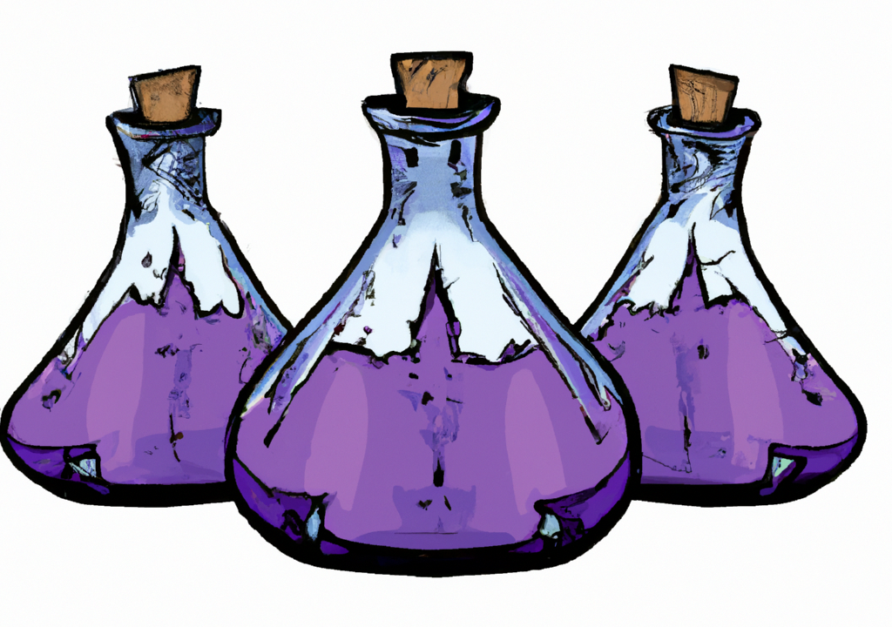


Hey Du,

Hast du Lust auf eine Geschichte? Denn wir haben heute eine mitgebracht. Vielleicht wunderst du dich, wie wir auf die
Idee gekommen sind, unseren gemeinsamen Blog anzufangen. Wenn dir heute nicht nach Geplapper ist, dann schau in unsere
Rezepte und tob dich aus ;)

Zlata: Ich experimentiere mit diversen Kosmetikformeln seit März 2022. Angefangen habe ich mit diversen
Gesichtsreinigern, die inzwischen einen soliden Reifegrad erreicht haben. Ich fühle mich sehr komfortabel mit dem
Gedanken, einige selbstgemachte Produkte zu verschenken. Sie werden sicher nicht in der Ecke eines Badschrankes einsam,
oder in Gesellschaft anderer unbeliebter Produkte, verstauben. Sie sind genau das, was ich in meinem Kopf von Anfang an
vorhatte, und haben sogar meine ursprüngliche Vorstellung in einigen Punkten übertroffen.

Ich entdecke gerne neue Dinge und gehe weiter. Gesichtspflege-Routinen zu bilden, die Jahre überdauern würden, war nie
meine Stärke, und das, obwohl mir bewusst ist, dass Regelmäßigkeit bei manch einer Gewohnheit das Erfolgsrezept ist. Aus
diesem Grund bin ich auf der Suche nach simplen und natürlichen Gerüchen, in die ich mich beim ersten Schnüffeln
verliebe. Denn was ist eine bessere Voraussetzung für eine lang anhaltende Gewohnheit als eine aufrichtige Liebe?

Yana ist meine work besty. Von Anfang an haben wir die gleiche Sprache, buchstäblich wie sinnbildlich, gesprochen. Als
woman in tech teile ich mit Yana viele gemeinsame Interessen wie Code, Katzen und Kosmetik. Yana malt leidenschaftlich
gern und hat einen ausgeprägten Sinn für Ästhetik, außerdem ist sie eine sehr direkte Person, was sich in dieser
ritualisierten Bürowelt wie ein Hauch frischer Luft anfühlt.

Weihnachten letzten Jahres hat Yana von mir einen Pflaumenölreiniger bekommen, welcher einen ausgeprägten Marzipanduft
besitzt - daher der Name Yanas Marzipan Make Up Remover. Und obwohl sie manchmal als ehemalige Schülerin in Chemie als
Leistungskurs scherzt, dass es ausgesprochen süßlich nach Zyankali duftet, hat dieser Duft sie auf die Reise geschickt,
selbst Kosmetik anzufertigen. Ich kann im Namen von uns beiden sagen, dass wir gespannt sind, wo diese Reise hinführt
und wir freuen uns darauf, dir unsere Experimente vorzustellen.

Read more about Zlata (Link)

Yana:

In der Welt der Kosmetikherstellung bin ich neu. Das bedeutet, dass ich noch sehr viele Fragen für mich und für euch
aufklären möchte. …

Zlata und ich haben uns bei der Arbeit kennengelernt. Ich habe selten solch einen neugierigen, intelligenten und
ehrlichen Menschen getroffen, wie sie. Ich muss zugeben, dass ich anfangs ihr Hobby, Kosmetik zu Hause herzustellen,
nicht ganz ernst genommen(?) habe. Meine Einstellung basierte darauf, dass der Markt bereits sehr viele Mittel
unterschiedlicher Qualität zum Kauf anbietet und daher erschien mir die umfangreiche Zeitinvestition als nicht sinnvoll.
Während ich es keinesfalls abgewertet habe, fand ich es eher kurios, dass eine technisch veranlagte Person sich
leidenschaftlich mit nicht-technischen Sachen beschäftigt. Das dachte ich, eine Entwicklerin, die in ihrer Freizeit
selbst malt, bastelt, backt und gärtnert - und somit auch ihre Freizeit mit kreativen und nicht-technischen Aktivitäten
füllt.

Meine Einstellung zu dem Thema hat sich geändert, nachdem ich meinen persönlichen Make Up Entfernen zu Weihnachten von
Zlata bekommen habe, der ganz betörend nach Marzipan roch. Dieses Mittel hatte eine ungewöhnliche Textur, die an weiche
Bodybutter erinnert hat. Das hat nicht nur mein Make Up entfernt, darüber hinaus hat es die Haut geschmeidig gemacht,
ohne einen öligen Film zu hinterlassen. Das war für mich verblüffend. Hier habe ich zum ersten Mal gesehen, dass man
selbst gute Kosmetik zu Hause herstellen kann.
Bis dahin, stellte ich mir das Herstellen der Kosmetik als irgendwas sehr aufwendiges vor, mit chemischen Stoffe, die
man nur in Großmengen kaufen kann, Geräten, die Tausende von Euros kosten und Doktoren, die Jahrzehnte das Handwerk
studiert und geübt haben. Nun ist nicht alles davon anders, In der Industrie und Forschung wird es sicherlich genauso
sein. Allerdings schließt es nicht aus, dass eine Privatperson ihre eigenen Kosmetikprodukte zu Hause herstellen kann.

Der letzte Schubser, um sich selbst an das Herstellen der Kosmetik ran zu machen, war für mich die Erkenntnis, dass
meine gekaufte, hochwertige Kosmetik voll mit Mikroplastik ist. Eigentlich habe ich mich bei der Kosmetik an “guten”
Namen und angenehme Konsistenz orientiert. Leider war das in meinem Fall keine Garantie für irgendwas.

Besonders spannend finde ich, dass man selbst über Inhaltsstoffe und Konsistenz des Produktes bestimmen kann, wenn man
es persönlich kreiert. Ich bin ein Mensch, der es einfach hasst, einen öligen Film auf meiner Haut zu haben. Nicht
fettende, haptisch leichte und angenehme Kosmetik ist die Richtung, in die ich mit meinen Experimenten gehen möchte.

Ich kann mich Zlata nur anschließen, wenn ich sage, dass ich unglaublich gespannt auf diese neue Wende in meinem Leben
bin und freue mich darauf, in eine für mich ganz neue Welt einzutauchen! Ganz besonders aufregend ist für mich, dich auf
diese Entdeckungsreise mitzunehmen!

Read more about Yana (Link)

Read more about Yana (Link)
Yanas Marzipan Make Up Remover -- 2 Versionen (Link)

We are: _Zlata & Yana_

_Read about [Zlata]()_

_Read about [Yana]()_


---
