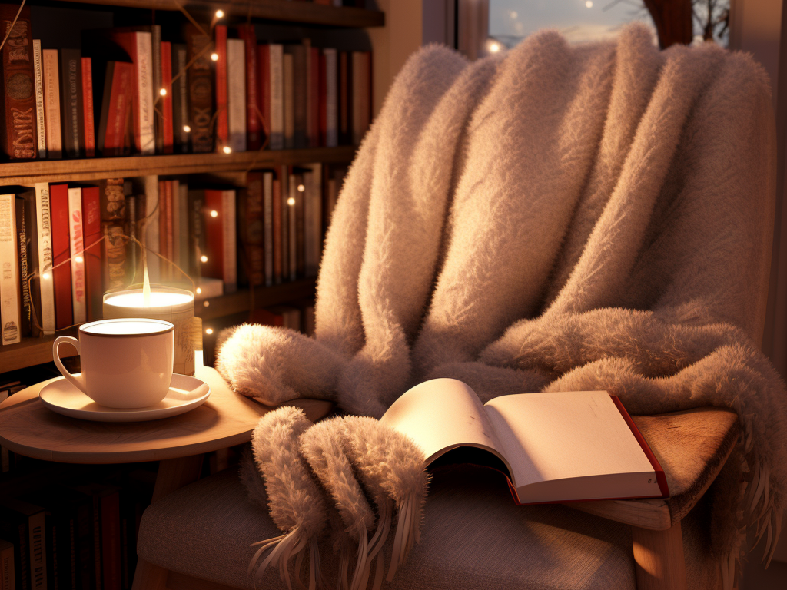

## Von Herbstimmung zur Lernstimmung

Hallo lieber Mensch,

Der Herbst ist meine liebste Jahreszeit. Egal, ob draußen Sturm und Regen toben, drinnen in meinem kuscheligen Zuhause sind die Bedingungen perfekt. Ich bin eingemummelt in eine warme Kuscheldecke, halte eine dampfende Tasse Kakao in der Hand, im Hintergrund läuft leise Jazzmusik, und vor mir – Lernvideos, Bücher und Skripte. Die dunklen langen Herbstabende sind für mich eine Einladung zum Lernen.

## Die Basics der Kosmetikherstellung

Seit Mitte September habe ich beschlossen, an Kursen teilzunehmen, um meine Kenntnisse in der Welt der Kosmetikherstellung zu vertiefen. Diese Entscheidung hat sich als äußerst lohnenswert herausgestellt, und ich möchte gerne meine bisherigen Erfahrungen mit dir teilen.

Ich habe mit der [Masterclass Compact](https://innometics.at/collections/online-kurse-master-class/products/online-kurs-master-class-compact) von Innometics begonnen, die aus vier spannenden einführenden Einheiten besteht: Chemische Grundlagen, Tenside, Emulsionen und Konservierung & Feuchthaltemittel. Christian, unser Dozent in allen vier Kurseinheiten, ist ein wahrer Rohstoff-Experte. Seine Begeisterung für das Fach ist ansteckend und er vermittelt intuitiv und verständlich Einblicke in die Chemie hinter unseren Lieblingsprodukten. Wenn du genauso wie ich für ungewöhnliche Kosmetikprodukte zu begeistern bist, dann ist Christian der richtige Ansprechpartner für alle deine Fragen. Dank ihm verstehe ich nun, warum meine alten Emulsionsrezepte manchmal grandiose Fehlschläge waren und wie ich sie jetzt verbessern kann.

## Sichere Rezepturen aus dem Heimlabor

Eines Herbsttages bin ich durch Zufall und Instagram auf die wunderbare Maike von [Slothlab](https://www.slothlab.de) gestoßen. Maike ist Chemikerin, Sicherheitsbewerterin und die kreative Kraft hinter Slothlab. Sie bietet eine breite Palette an Kursen und Seminaren an, darunter Webinare und Seminare zur sicheren Kosmetikrezepturentwicklung, Herstellung und Verkauf von Kosmetikprodukten. Ihre Kurse zeichnen sich durch eine ausgewogene Mischung aus Theorie und Praxis aus, außerdem gibt sich Maike Mühe eine engagierte Community aufzubauen, in der man effektiv gemeinsam lernen kann.

Ein echtes Highlight war das Seminar "Sicherer Kosmetikrezepturen" von Maike. Hier konnte ich nicht nur mein Wissen erweitern, sondern auch meine eigene Rezeptur entwickeln und die Sicherheitsgrenzen der einzelnen Rohstoffe erkunden. Maike war während des Seminars stets zur Stelle, um Fragen zu beantworten und Feedback zu geben. Sie hat mich mit ihrer Expertise und Leidenschaft für das Thema regelrecht angesteckt. Aktuell befinde ich mich mitten im Kurs [Kosmetik Wissen](https://www.slothlab.de/kosmetik-wissen) von Maike und habe mir das Ziel gesetzt, am Ende des Kurses eine Mini-Pflegelinie für einen bestimmten Hauttyp zu entwickeln.

## Zum Schluss

Ich bin wirklich glücklich, solche Dozenten und Kursleiter gefunden zu haben, die ihre Begeisterung und ihr Wissen offen teilen. Ich möchte betonen, dass es keine Kooperationen mit Innometics oder Slothlab gibt. Meine Empfehlung basiert allein auf meinen positiven Erfahrungen und der Qualität der Wissensvermittlung, die ich in diesen Kursen erhalten habe. Ich hoffe, meine Erfahrungen inspirieren dich, deine eigene Leidenschaft für die Kosmetikherstellung zu entdecken. Wenn du schon immer von der Herstellung eigener Kosmetik geträumt hast, hoffe ich, dass meine Empfehlung dir den nötigen Anstoß gibt, um loszulegen.


