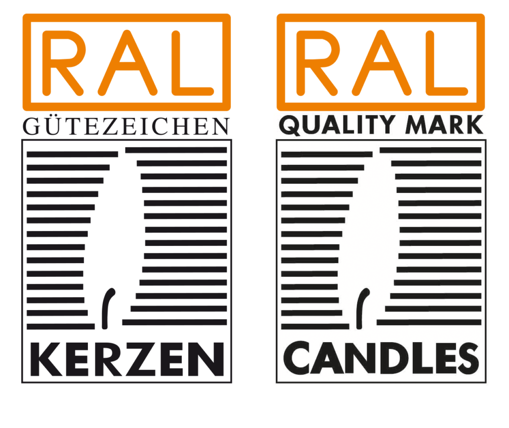

Ich liebe Kerzen! Und du? Ich mag das schummrige Feuer der Kerzen, das sanfte Licht und die entspannte Stimmung, die sie
verbreiten. Es existieren unzählige kreative Varianten von Kerzen, die einen Raum mit stimmungsvollen Akzenten füllen
können.

Nur die “sicheren” Kerzen sind verhältnismäßig gar nicht so oft vertreten. Unbedenkliche Kerzen sind unter anderem
Kerzen, die aus hochwertigeren Wachsen bestehen und nicht aus einem oder mehreren stinkenden dubiosen Rohstoffen
hergestellt werden. Es gibt inzwischen ganz viele Kerzen aus Sojawachs oder Kokoswachs. Auch das Bienenwachs kann eine
umweltfreundliche Alternative zur Paraffin sein, allerdings ist es nicht vegan. Das Wachs ist längst nicht alles, worauf
es bei einer Kerze ankommt. Vielfältige Behälter, tolle Farben und exotische Aromen sind inzwischen bei den Kerzen nicht
mehr wegzudenken.

Bei meiner Recherche hat sich eine ganz neue Welt der Gefahren(?) offenbart. Bei einem Brennvorgang können sehr viele
giftige und unerwünschte chemische Produkte entstehen, die auf ihre unsichtbare Art bei uns Allergien verursachen oder
sogar kanzerogen wirken können.
Wie ich herausgefunden habe, ist eine gute Orientierung bei den Kerzen der
[RAL-Gütezeichen](#das-ral-gütezeichen). Überraschenderweise ist es gar nicht so
einfach, eine schöne, parabenfreie und sichere Kerze zu finden. Dazu steigt der Preis des Gegenstands oft
proportional zu dem edlen Aussehen und der Sicherheit. Hast du schon mal eine schlichte RAL-zertifizierte Kerze für 40 Euro
gesehen? Ich ja.
Dieses Wissen und meine kreative Strähne haben mich dazu bewegt, sichere Kerzen selber herzustellen.

### Eine Kerze selber herstellen, was kann da einfacher sein?

Mit dem Gedanken habe ich mich an das Kerzengießen gemacht und bin anfangs hoffnungslos gescheitert. Ziemlich schnell
musste ich feststellen, dass diese arrogante Haltung nicht produktiv ist. Meine ersten Kerzen waren schmierig, brannten
nicht oder wollten nicht an einem Stück aus den Gießformen raus. Das Schlimme war, dass es jedes Mal etwas anderes war,
was nicht funktioniert hat, also war das Ergebnis jeweils unvorhersehbar. Wie es sich gehört, habe ich angefangen nach
mehr Wissen zu suchen, erst nachdem es nicht funktioniert hat :).

Ich möchte mit dir meine Erfahrungen teilen, damit Du es einfacher hast, falls du auch deine eigenen Kerzen herstellen
möchtest.

### Das Wachs

Für meine ersten Versuche habe ich Sojawachs gewählt. Nun, gleicht nicht jedes Sojawachs dem anderen. Nach ein paar
frustrierenden Versuchen mit einem günstigen Noname Sojawachs habe ich ein recht teures Sojawachs gewählt (Nature wax
c3). Das Arbeiten mit diesem Wachs war viel angenehmen - das Verhalten vom Wachs war vorhersehbar, das Ergebnis hatte
eine gleichmäßige Farbe und brannte ziemlich lange.
Aber auch das war nicht alles. Es ist wichtig darauf zu achten, ob man ein Wachs für Containerkerzen oder freistehende
Kerzen benutzt, denn bei falscher Wachsart können freistehende Kerzen schmierig und instabil sein und die
Containerkerzen haften eventuell nicht so gut am Container und sehen dann nicht besonders schön aus.
Deswegen habe ich mich am Anfang für eine Art der Kerzen entschieden, wo ich meine ersten Erfahrungen sammeln möchte.

### Der Docht

Hast du dir schon mal Gedanken über einen Kerzendocht gemacht? Es gibt Dochte aus Baumwolle, aus Holz und diversen
anderen Materialien. Die Dochte, die ich persönlich ganz toll finde, sind aus Holz. Allerdings brannten sie anfangs
nicht wirklich gut bei mir, die Kerzen gingen nach wenigen Minuten aus und auch da musste ich genauer nachlesen, was da
eigentlich das Problem ist. Klar hat unterschiedliches Holz auch unterschiedliche Brenneigenschaften, bei manchen
Exemplare
soll das Einölen vor Benutzung scheinbar helfen. Ach ja, die Dicke des Dochts muss zum Kerzedurchmesser
passen, sonst brennt sie nicht anständig, oder brennt zu doll.
In meinen Experimenten habe ich festgestellt, dass der Durchmesser der Kerze zu dem Docht passen muss, dann brennt die
Kerze anständig.
Außerdem muss die herausstehende Länge des Dochtes richtig sein. Bei einem zu langem Docht brennt die Kerze wie ein
Tannenbaum
beim Osterfeuer, bei einem
zu kurzem brennt er gar nicht.

### Die Duftstoffe

Was ich wirklich sehr problematisch finde, ist die Wahl eines Duftstoffes für die Kerzen.
Aktuell suche ich selber noch nach ungefährlichen, geprüften Kerzenduften, die beim Verbrennen keine schädliche Stoffe
produzieren und keine bekannten Allergene enthalten. Allergene sind auch ganz große Spaßverderber und ich möchte davon
möglichst wenig in meinen Kerzen haben. Leider enthalten die natürlichen ätherischen Öle bzw. natürliche Duftstoffe von
Natur aus ganz viele Allergene, die teilweise problematisch sind. Ein Beispiel dafür ist der natürliche Duftstoff
[Linalool](https://www.chemie.de/lexikon/Linalool.html#:~:text=Linalool%20ist%20Bestandteil%20vieler%20%C3%A4therischer,sich%20in%20vielen%20%C3%A4therischen%20%C3%96len.)
, der allerdings starke allergische Reaktionen hervorrufen kann. Dieser Stoff ist unter anderem in Zimt und
Koriander enthalten.

Worauf man bei der Wahl des Duftstoffes achten sollte, ist
das [IFRA-Zertifikat](https://ifrafragrance.org/safe-use/ifra-certificates) , in dem die Inhaltsstoffe, Mengenangaben
und empfohlene Konzentrationen ausführlich niedergeschrieben sind. IFRA-Zertifikat schließt allerdings trotzdem keine
Allergene aus, sondern nur die besonders problematischen, wie beispielsweise der Duftstoff Lilial ([‘Butylphenyl
Methylpropional’](https://de.wessling-group.com/de/ab-1-maerz-2022-gilt-das-verbot-des-duftstoffs-lilial)), welcher
seit 1. März 2022 verboten ist. Außerdem bestimmen die IFRA-Prüfungen die zulässigen Konzentrationsangaben der
jeweiligen
Duftstoffen für unterschiedliche
Verwendungsgebiete, wie Kerzen und Kosmetik.

Das RAL-Gütezeichen schließt in dem Fall ein IFRA-Zertifikat ein
und ist sogar noch strenger. Ich konnte bis jetzt keine
Duftstoffe bei dem empfohlenen [Lieferanten](https://ral-c.com/mitglieder/duftstoffe/) erwerben, vermutlich ist der
Verkauf bei den Produzenten nur in industriellen Mengen vorgesehen.

Abgesehen von den Inhaltsstoffen spielt der Geruch an sich eine wichtige Rolle: einfach nur Kokos kann exotisch und
verführerisch wirken, aber auch zu flach und dadurch “billig”.

### Die Wachsfarben

Bei den Farben war das ein bisschen einfacher, die RAL-Gütezeichen empfohlene Farben konnte ich in kleinen Mengen im
Internet erwerben. Auch hier greife ich zu “sicheren” Farbstoffen, denn auch sie werden zusammen mit dem Wachs verbrannt
und können gefährliche Stoffe produzieren, die keiner bewusst oder unbewusst einatmen möchte.
Es gibt RAL-anerkannte Lieferanten, die [hier](https://ral-c.com/farben-und-lacke/) aufgelistet sind.

### Das RAL-Gütezeichen

Ich habe bereits ein paar Mal auf den [RAL-Gütezeichen](https://ral-c.com/ral-guetezeichen/) hingewiesen, aber was ist
das eigentlich? Hierbei
handelt es sich um ein wichtiges Zertifikat in Deutschland, welches sicherstellt, dass die gekennzeichnete
Kerzen sowohl eine hohe Qualität haben als auch deren Bestandteile in keiner Weise der Gesundheit schädigen,
ruß- und raucharm sind, keinerlei schadstoffbelastete Rohstoffe, Farben oder Lacke beinhaltet.
Ich denke, dass dieses Wissen ähnlich zum Phänomen der
Vexierbilder ([Kippfiguren](https://www.sehtestbilder.de/optische-taeuschungen-illusionen/illusion-alte-oder-junge-frau-sehtest.php))
ist,
also wenn man einmal ein "verstecktes" Bild entdeckt hat, sieht man das Bild mit ganz neuen Augen. Seitdem ich verstehe
welche versteckte Gefahren in Kerzen
verborgen
sein können, würde ich niemals eine Kerze ohne den RAL-Siegel kaufen, oder eine alte Kerze anzünden.

### Warum habe ich mich weiterhin mit dem Thema beschäftigt?

Wie man merkt, in jedem Handwerk steckt auch ganz viel Know-How, zum Glück muss man viele Sachen nur einmal am Anfang
klären und danach kann man sein Wissen immer wieder erweitern und vertiefen.

Es wäre gelogen, wenn ich behauptet hätte, dass mein Weg zur Kerzenherstellung ein blumiger Spaziergang war, der im
übrigen noch nicht vorbei ist. Ich habe definitiv mehr als nur ein Mal gesagt: "Oh mein Gott, brauche ich das alles
wirklich?”.
Die Menge an Informationen hat mich anfangs überfordert und irgendwie fand ich es fast schon unglaubwürdig, wie viele
Details diese “simple” Sache hat. Ich habe nun auf jeden Fall viel mehr Respekt vor Kerzenmanufakturen. Zudem habe ich
sehr viele unterschiedliche Anleitungen im Internet gefunden, “wie eine Kerze zu 100% gelingt”. Nur irgendwie war keine
Anleitung das Ultimative für mich. Der Trick liegt letztendlich daran, sich an den Prinzipien und Vorgaben der
Produktherstellern zu orientieren und eigene Erfahrung zu sammeln.
Wie ich am Anfang geschrieben habe, liebe ich Kerzen. Und je mehr ich darüber gelernt habe, desto mehr habe ich auf
wichtige Sachen, wie Schadstofffreiheit, geachtet. Abgesehen davon, wenn ich dabei im Internet schlichte Kerzen für
freche Preise finde, frage ich mich einfach, ob die Menschen in ihrer Arroganz den Verstand verloren haben. Ohne
Zweifel haben gute und zertifizierte Produkte ihren Wert, dennoch kommen mir manche Preise als absolut übertrieben vor.

Zusätzlich, habe ich mir ein weiteres Ziel gesetzt:

### Ein Geschenk für einen Kollegen

Damit ich für meine Experimente mehr Motivation und eine Art Deadline habe, habe ich mir vorgenommen, eine schöne,
vegane, gesunde Kerze für einen Kollegen zu gießen, der leider bald unser Team verlässt.

Wie schon beschrieben, habe ich viele Experimente durchgeführt und sehr viel Erfahrung gesammelt, um diese recht
schlichten Kerzen zufriedenstellend gießen zu können. Hierbei ging es mir nicht nur
um die Techniken, sondern vor allem darum, ich eine “sichere” Kerze herzustellen. Natürlich habe ich die Kerze nun nicht
zertifizieren lassen, aber da ich einen guten und hochwertigen Wachs und einen Baumwolldocht verwendet habe,
kann ich diese Kerze mit einem guten Gewissen verschenken.

Wenn du lesen möchtest, wie ich meine erste Kerze zum Verschenken hergestellt habe, schau in den Artikel, wo ich den
Herstellungsverfahren dazu beschreibe.

