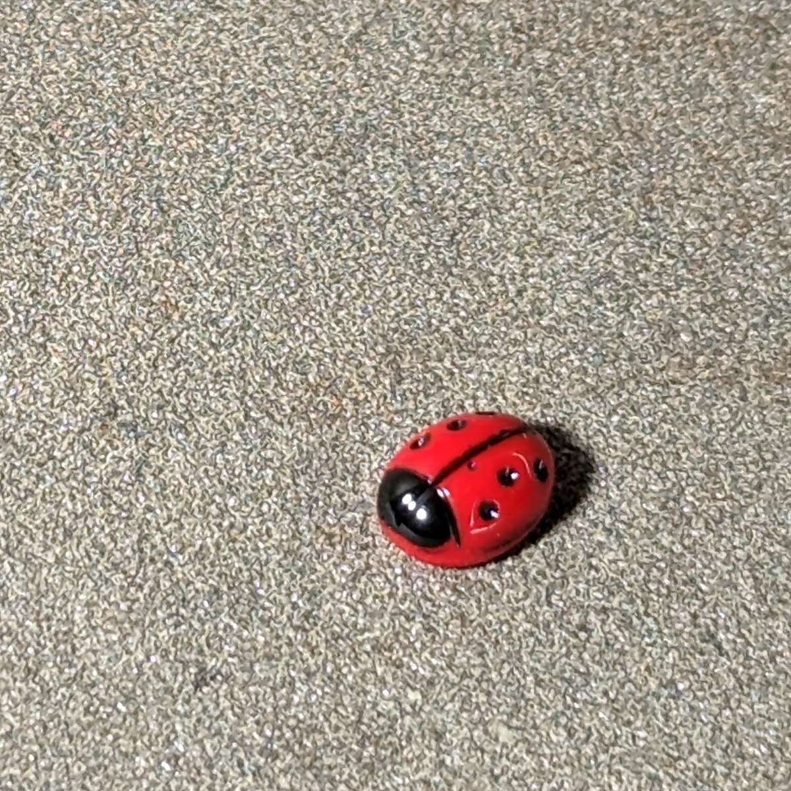

Hallo lieber Mensch,

ich freue mich, dir meine erste selbstgemachte Kerze zum Verschenken vorzustellen!
Bevor ich diese schlichte Kontainerkerze gegossen habe, habe ich mit einigen Fehlversuchen meine Erfahrung gesammelt. Es
war für mich sehr wichtig sowohl das Wachs kennenzulernen, als auch die Technik des richtigen Erhitzens und Gießens zu
verstehen.
Letztendlich habe ich gelernt, dass ich eine Sequenz von einfachen Schritten einhalten muss, damit ich ein gutes
Ergebnis erziele. In diesem Post werde ich diese Schritte beschreiben.

## Die Entstehung meiner ersten verschenkten DIY Kerze

Und du bist dabei! Ich finde das sehr aufregend! :heart:

Diese Kerze habe ich für einen Arbeitskollegen gemacht, der unser Team demnächst verlässt. Unser Arbeitsteam hat ein
Logo in roten und weißen Farben. Eine elegante Kombination aus saftigem Rot und purem
Weiß finde ich persönlich ästhetisch ansprechend und kräftig, so dass ich weitere Dekoelemente
überflüssig finde. Es gibt nur eine Sache, auf die ich auf keinen Fall hier verzichten möchte - einen
versteckten Glückskäfer.

### Die Idee

besteht darin, dass der Glückskäfer mit Wachs bedeckt wird und wenn die Kerze brennt und das Wachs durch das
Erwärmen durchsichtig wird, zum Vorschein kommt.

Als den Behälter für die Kerze habe ich ein leeres Glas von meiner Lieblingsmarmelade verwendet. Das Glas habe ich
von Außen mit roter Farbe und den Deckel mit weißer Farbe übermalt, da diese Farbkombination
unseren Teamfarben entspricht.

## Vorbereitung

### Geräte

Es ist wichtig, dass alle verwendetet Geräte und Gegenstände sauber, trocken, fett- und stabfrei sind. Wir wollen ja
schließlich
nicht, dass in der Kerze Schmutz eingeschlossen wird.

Das Wachs wird am besten in einem Wasserbad geschmolzen. Das Wasser wird erhitzt, es darf jedoch nicht aufkochen, sonst
kann das sprudelnde Wasser in das Wachs reinspritzen. Wachs ist hydrophob (wasserabweisend) und verträgt sich deswegen
nicht mit Wasser. Selbst
kleine Mengen an Feuchtigkeit können dafür sorgen, dass die aufgeschmolzene Wachsmasse ihre Eigenschaften
verändert und die Kerze dann unerwünschte Defekte, wie z.B. eine Verfärbung, aufweist.

### Der Container (Marmeladen Glas)

Natürlich muss auch dieser Gegenstand sauber und trocken sein. Da ich das Glas in Rot haben wollte, habe ich es im
Vorfeld angemalt und trocknen lassen, sodass ich es jetzt benutzen kann.

Das Glas wärme ich über ein Wasserbad ein wenig an, damit die Glaswände nicht kalt sind, wenn das heiße Wachs
ausgegossen wird. Das erhöht die Adhäsion vom Wachs an den Glaswänden.

### Der Docht

muss zum Kerzendurchmesser passen. Die Hersteller bzw. die Verkäufer geben häufig Angaben für die Dochte und den
Kerzendurchmesser an, die hilfreich für die Wahl eines passenden Dochtes sind.
Für meine Kerze mit dem Durchmesser von 8cm empfiehlt der Hersteller einen runden Kerzendocht in der Größe 8.
Falls dir diese Informationen für deinen Docht bzw. Kerze fehlen, musst du wohl hier die empirische Forschungsmethode
anwenden, also ausprobieren.

Der Kerzendocht muss in dem Kerzenbehälter festgeklebt werden. Dafür kann der Docht an einem Metallfuss
befestigt werden, welcher dann auch am Behälterboden fest geklebt wird. Den Metallfuss kann man am besten mit
Kleber oder mit einem kleinen runden Klebesticker kleben.

Es ist auch möglich, einen Docht ohne einen Metallfuss zu kleben. Ich habe es aber nicht ausprobiert. Was nicht
funktioniert, ist einen Docht mit einem Tropfen Wachs zu kleben. Beim Eingießen vom heißen Wachs in das Glas
wird dieser Wachstropfen wieder heiß und flüssig. Der Docht klebt damit nicht mehr am Boden. Just saying, falls
diese spontane Idee dich, genau wie mich bei meinen ersten Experimenten, besucht haben sollte :wink:

Nachdem der Kleber fest geworden ist, muss der Docht gerade ausgerichtet und fixiert werden, sonst
verschiebt sich der Docht seitlich oder versinkt im flüssigen Wachs. Ich benutze dafür zwei Esstäbchen, zwischen
denen ich einen Docht wunderbar einklemmen und dann vorsichtig spannen und zentrieren kann.

### Wachs

Jede Wachsart und jeder Hersteller haben eigene Angaben zur Schmelz- und Ausgießtemperatur des Wachs. Sie können sich
auch bei unterschiedlichen Wachsarten, /-marken, /-herstellern variieren, daher sollte man diese bei dem Hersteller
nachlesen. Wichtig sind vor allem folgende Werte:

* Maximale Schmelztemperatur: auf wie viel Grad darf das Wachs maximal erhitzt werden
* Ausgießtemperatur: bei wie viel Grad soll das Wachs in die Form eingegossen werden

Hierfür nutzte ich ein Thermometer und kann es dir auch sehr empfehlen.

Bei dem Sojawachs, das ich verwendet habe, empfiehlt der Hersteller das Einschmelzen bis maximal 70°C und das Ausgießen
bei 50°C. Wenn man keine Farbe oder andere Zusätze reinmischt, muss man das Wachs nicht bis zur maximalen Temperatur
erhitzen.


Vorsicht, Verbrennungsgefahr! Geschmolzener Wachs ist eine heiße Sache und damit muss vorsichtig gearbeitetet werden


Hier sind noch zwei hilfreiche Empfehlungen:

* Wachs wird langsam und kontrolliert im Wasserbad erhitzt
* Wachs wird sehr vorsichtig und laaaaangsam beim Erhitzen gerührt

Wichtig ist, dass die frisch eingegossene Kerze weder bewegt noch geschoben wird. Nur so kann das
Wachs gleichmäßig abkühlen.

## Verwendete Geräte und Inhaltsstoffe

| Bezeichnung                                       | Menge       |
|---------------------------------------------------|-------------|
| **Inhaltsstoffe**                                 |
| Sojawachs, _Ecosystem RCX Container Wax_          | 150g       |                  
| Docht Gr. 8                                       | 1           |                  
| **Geräte**                                        |
| Glasdose mit Deckel (upcycling), Durchmesser 8 cm | 1           |                  
| Rote und Weiße Farbe                              | nach Bedarf |                  
| Topf zum Schmelzen                                | 1           |                  
| größerer Topf für Wasserbad                       | 1           |                  
| Rührspatel                                        | 1           |                  
| Thermometer                                       | 1           |                  
| Esstäbchen                                        | 2           |                  
| Glückskäfer aus Glas                              | 1           |

## Durchführung

Ich habe mein Wachs in zwei Portionen aufgeteilt, weil ich einen Glückskäfer zwischen den Wachsschichten verstecken
möchte. Die erste Schicht muss antrocknen, sodass ich den Glückskäfer drauflegen kann, ohne dass er versinkt. Nach dem
die erste Schicht trocken ist und der Käfer plaziert ist, kann die zweite Schicht einfach darauf gegossen werden.

Meine erste Schicht besteht aus 120g Wachs. Die zweite Schicht, die ca 1cm dick sein soll, wiegt etwa 30g.

Nach dem Abwiegen des Wachses, kannst du das Wasserbad vorbereiten und das Wasser erhitzen. Jetzt kann das Wachs
geschmolzen werden 😊

### Schicht 1.:

Ich habe die erste Wachsschicht (120g) langsam auf 60°C erhitzt, bis es vollständig geschmolzen war. Es ist ratsam
nicht zu viel zu rühren, weil sich sonst kleine Luftbläschen im Wachs verfangen und dann beim Abkühlen in der Kerze
bleiben. Das geschmolzene Sojawachs ist durchsichtig.

Das heiße Wachs muss nun auf die Ausgießtemperatur abkühlen, diese liegt bei ca 50°C. Nachdem die gewünschte
Temperatur erreicht ist, wird das Wachs in den warmen Kerzenbehälter vorsichtig eingegossen.

Der Behälter wird vorsichtig mit den Fingern abgeklopft, damit die entstandene Luftbläschen nicht im Wachs gefangen
bleiben und das
Brennverhalten der Kerze stören.
Danach muss die Kerze abkühlen und wieder ihre weiße Farbe bekommen.

Jetzt kann der Glückskäfer auf der ersten Schicht platziert werden.

### Und nun die 2. Schicht:

Die restlichen 30g Wachs werden genau so behandelt wie die erste Schicht. Wenn das Wachs auf die Ausgießtermperatur
abgekühlt ist, kann es auf die erste Schicht gegossen werden. Ich habe mein Kerzenglas vorsichtig seitlich
abgeklopft, damit alle sich eventuell gebildeten Luftbläschen das Wachs verlassen können.

Ab jetzt wird die Kerze nicht mehr bewegt. Die Kerze muss für ein paar Stunden in Ruhe bei Zimmertemperatur
abkühlen, bis das Wachs
fest ist. Danach kann der Docht von den Essstäbchen befreit und auf 0,5cm gekürzt werden.

Die Kerze ist fertig! Viel Spass beim Ausprobieren 😉

## P.S.

Übrigens habe ich beim Verschenken der Kerze festgestellt, dass unser Arbeitskollege meine Kerzenpassion nicht gänzlich
teilt 😅

Auf Dekorationen und stimmungsvolle Akzente legt Malte nicht sehr viel Wert. Der 🐞 war trotzdem eine schöne
Überraschung für unseren Kollegen. Hoffentlich sorgt die Kerze bei ihm weiterhin für gute Stimmung und erinnert ihn an
unser Team :heart: