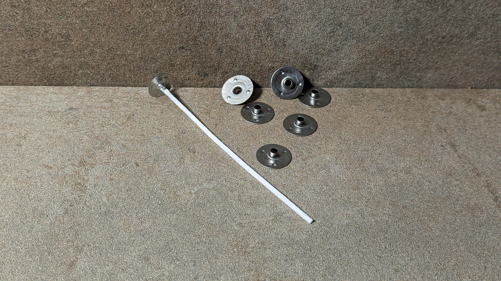
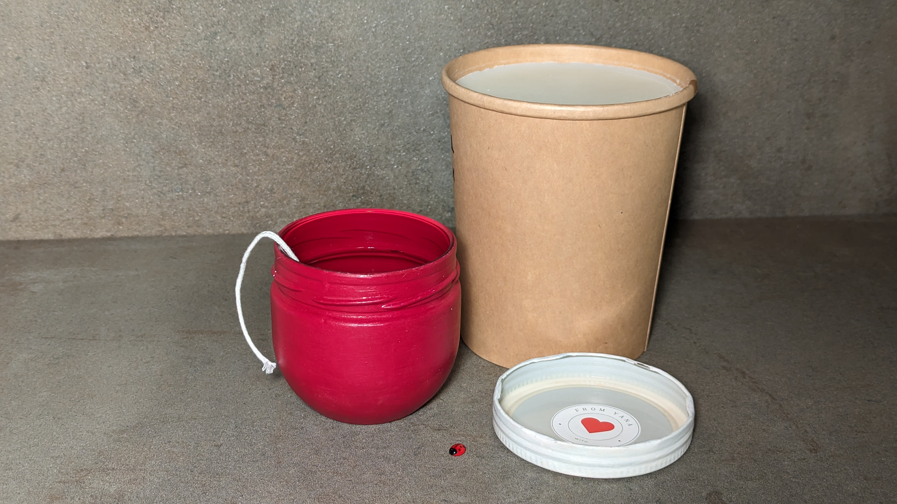
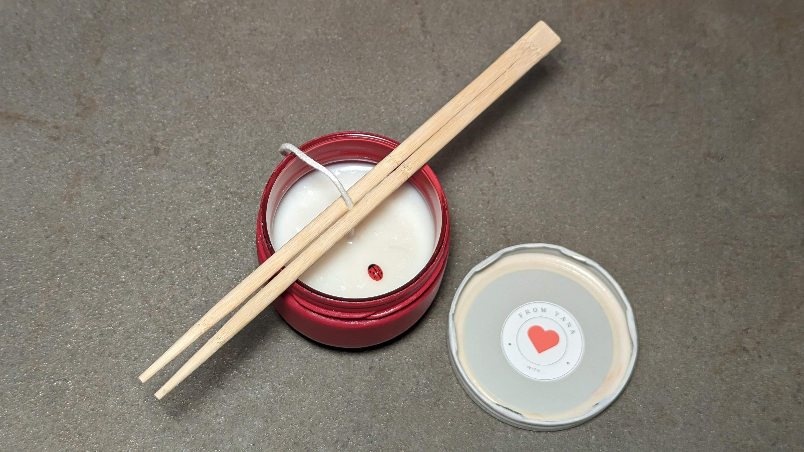
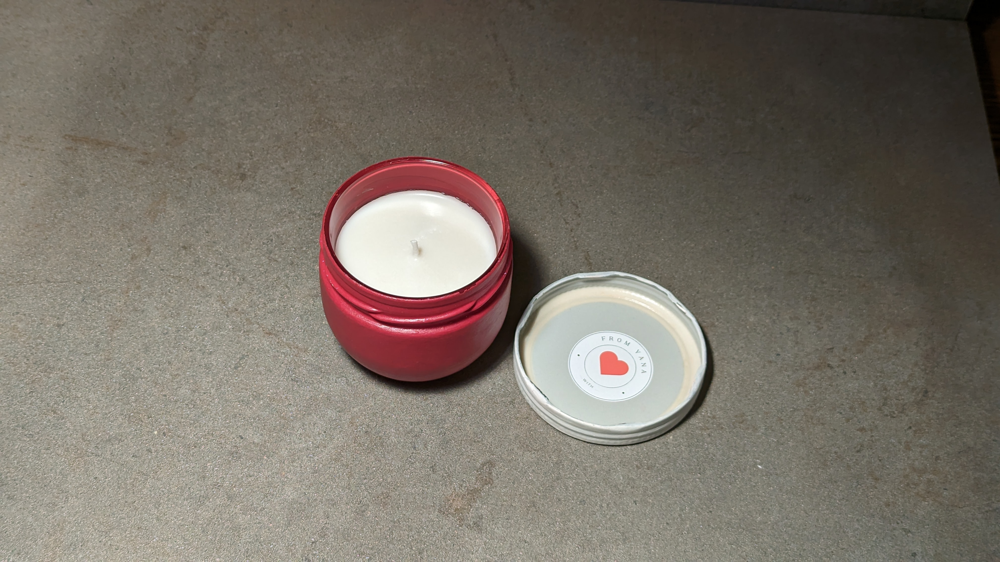

[//]: # (## Eine Kerze für Malte)

Hallo lieber Mensch,

ich freue mich, dir meine erste selbstgemachte Kerze zum Verschenken
vorzustellen! Bevor ich diese schlichte Kontainerkerze gegossen habe, habe ich
mit einigen Fehlversuchen meine Erfahrung gesammelt. Ich habe es mir das Ziel
gesetzt, die Verarbeitung von Wachs besser zu verstehen, und die richtige
Erhitz- und Gießtechniken zu erforschen. Letztendlich habe ich gelernt, dass ich
eine Sequenz von einfachen Schritten einhalten muss, damit ich ein gutes
Ergebnis erziele. In diesem Post werde ich diese Schritte beschreiben, damit du
auch eine eigene Kerze selber gießen kannst.

## Die Entstehung meiner ersten DIY Geschenkkerze



Und du bist dabei! Ich finde das sehr aufregend! :heart:️

Diese Kerze habe ich für einen Arbeitskollegen gegossen, der unser Team
demnächst verlässt. Unser Arbeitsteam hat ein Logo in roten und weißen Farben.
Eine elegante Kombination aus saftigem Rot und purem Weiß finde ich persönlich
ästhetisch ansprechend und kräftig, so dass ich weitere Dekoelemente überflüssig
finde. Es gibt nur eine Sache, auf die ich auf keinen Fall hier verzichten
möchte - einen versteckten Glückskäfer.

Diese Kerze ist natürlich vegan und umweltfreundlich, daher wird sie aus
Sojawachs und z.B. nicht aus Bienenwachs oder Paraffin gegossen.

### Die Idee

besteht darin, dass der Glückskäfer mit Wachs bedeckt wird und wenn die Kerze
brennt und das Wachs durch das Erwärmen durchsichtig wird, zum Vorschein kommt.

Als Behälter für die Kerze habe ich ein leeres Glas meiner Lieblingsmarmelade
verwendet. Das Glas habe ich von Außen mit roter Farbe und den Deckel mit weißer
Farbe übermalt.

## Vorbereitung

### Geräte

Es ist wichtig, dass alle verwendetete Geräte und Gegenstände sauber, trocken,
fett- und staubfrei sind. Das ist wichtig, damit in der Kerze kein Schmutz
eingeschlossen wird.

Das Wachs wird am Besten in einem Wasserbad erhitzt, so bekommt man mehr
Kontrolle beim Erhitzen. Das Wasser wird erhitzt, es darf jedoch nicht
aufkochen, sonst kann das sprudelnde Wasser in das Wachs reinspritzen. Wachs ist
hydrophob (wasserabweisend) und verträgt sich deswegen nicht mit Wasser. Selbst
kleine Mengen an Feuchtigkeit können dafür sorgen, dass die aufgeschmolzene
Wachsmasse ihre Eigenschaften verändert und die Kerze dann unerwünschte Defekte,
wie z.B. eine Verfärbung, aufweist..

### Der Container (Marmeladen Glas)

Natürlich muss auch dieser Gegenstand sauber und trocken sein. Da ich das Glas
in Rot haben wollte, habe ich es im Vorfeld angemalt und trocknen lassen, sodass
ich es jetzt benutzen kann.

Das Glas wärme ich über ein Wasserbad ein wenig an, damit die Glaswände nicht
kalt sind, wenn das heiße Wachs ausgegossen wird. Das erhöht die Adhäsion (
Anhaften) vom Wachs an den Glaswänden.

### Der Docht

ist in diesem Fall ein Garn aus Baumwolle. Wichtig ist, dass der Docht zum
Kerzendurchmesser passt. Die Hersteller bzw. die Verkäufer geben häufig Angaben
für die Dochte und den Kerzendurchmesser an, die hilfreich für die Wahl eines
passenden Dochtes sind. Für meine Kerze mit einem Durchmesser von 8cm empfiehlt
der Hersteller einen runden Kerzendocht in Größe 8. Falls dir diese
Informationen für deinen Docht bzw. Kerze fehlen, musst du wohl hier die
empirische Forschungsmethode anwenden, also ausprobieren.

Der Kerzendocht muss in dem Kerzenbehälter befestigt werden. Dafür kann der
Docht an einem Metallfuß befestigt werden, welcher dann auch am Behälterboden
mittig fest geklebt wird. Den Metallfuß kann man am besten mit Kleber oder mit
einem kleinen runden Klebesticker befestigen.

Es ist auch möglich, einen Docht ohne einen Metallfuß zu kleben. Ich habe es
aber nicht ausprobiert. Was nicht funktioniert, ist einen Docht mit einem
Tropfen Wachs zu kleben. Beim Eingießen vom heißen Wachs in das Glas wird dieser
Wachstropfen wieder heiß und flüssig. Der Docht klebt nicht mehr am Boden. Just
saying, falls diese spontane Idee dich, genau wie mich bei meinem ersten
Experiment, besucht haben sollte 😉

Nachdem der Kleber festgeworden ist, muss der Docht mittig und gerade
ausgerichtet und fixiert werden, sonst verschiebt sich der Docht seitlich oder
versinkt im flüssigen Kerzenwachs. Ich benutze dafür zwei Essstäbchen, zwischen
denen ich einen Docht wunderbar einklemmen und dann vorsichtig spannen und
zentrieren kann.


Achte darauf, dass dein Kerzendocht länger ist, als die Kerze, damit du ihn
spannen kannst.


### Wachs

Jede Wachsart und jeder Hersteller haben eigene Angaben zur Schmelz- und
Ausgießtemperatur des Wachs. Sie können unterschiedlichen Marken und Wachsarten
variieren, daher sollte man diese bei dem Hersteller nachlesen. Wichtig sind vor
allem folgende Werte:

* Maximale Schmelztemperatur: auf wie viel Grad darf das Wachs maximal erhitzt
  werden
* Ausgießtemperatur: bei wie viel Grad soll das Wachs in die Form eingegossen
  werden

Um die diese Werte zu kontrollieren, nehme ich ein Thermometer.

Bei dem Sojawachs, das ich verwendet habe, empfiehlt der Hersteller das
Einschmelzen bis maximal 70°C und das Ausgießen bei 50°C. Wenn man keine Farbe
oder andere Zusätze reinmischt, muss man das Wachs nicht bis zur maximalen
Temperatur erhitzen.


Vorsicht, Verbrennungsgefahr! Geschmolzenes Wachs ist eine heiße Sache und damit
musst du achtsam umgehen


Hier sind noch zwei hilfreiche Empfehlungen:

* Wachs wird langsam und kontrolliert im Wasserbad erhitzt
* Wachs wird sehr vorsichtig und laaaaangsam beim Erhitzen gerührt

Wichtig ist, dass die frisch eingegossene Kerze weder bewegt noch geschoben
wird. Nur so kann das
Wachs gleichmäßig abkühlen.

## Verwendete Geräte und Inhaltsstoffe

| Bezeichnung                                       | Menge       |
|---------------------------------------------------|-------------|
| **Inhaltsstoffe**                                 |
| Sojawachs, Ecosystem RCX Container Wax_           | 150g       |                  
| Docht Gr. 8                                       | 1           |                  
| **Geräte**                                        |
| Glasdose mit Deckel (upcycling), Durchmesser 8 cm | 1           |                  
| Rote und Weiße Farbe                              | nach Bedarf |                  
| Topf zum Schmelzen                                | 1           |                  
| größerer Topf für Wasserbad                       | 1           |                  
| Rührspatel                                        | 1           |                  
| Thermometer                                       | 1           |                  
| Esstäbchen                                        | 2           |                  
| Glückskäfer aus Glas                              | 1           |

## Durchführung

Ich habe mein Wachs in zwei Portionen aufgeteilt, weil ich einen Glückskäfer
zwischen den Wachsschichten verstecken möchte. Die erste Schicht muss fest
werden, sodass ich den Glückskäfer drauflegen kann, ohne dass er versinkt. Nach
dem die erste Schicht trocken ist und der Käfer plaziert ist, kann die zweite
Schicht einfach darauf gegossen werden.

Meine erste Schicht besteht aus 120g Wachs. Die zweite Schicht, die etwa 1cm
dick sein soll, wiegt etwa 30g.

Nach dem Abwiegen des Wachses kannst du das Wasserbad vorbereiten und das Wasser
erhitzen. Jetzt kann das Wachs geschmolzen werden 😊

### 1. Schicht:

Ich habe die erste Wachsschicht (120g) langsam auf 60°C erhitzt, bis es
vollständig flüssig ist. Es ist ratsam nicht zu viel zu rühren, weil sich sonst
kleine Luftbläschen im flüssigen Wachs verfangen und dann beim Abkühlen in der
Kerze bleiben. Das geschmolzene Sojawachs ist durchsichtig.

Das heiße Wachs muss nun auf die Ausgießtemperatur abkühlen, diese liegt bei ca
50°C. Nachdem die gewünschte Temperatur erreicht ist, wird das Wachs vorsichtig
in die warme Gefäß vorsichtig eingefüllt.

Der Behälter wird vorsichtig mit den Fingern abgeklopft, damit die entstandene
Luftbläschen nicht im Wachs gefangen bleiben und das Brennverhalten der Kerze
stören. Danach muss die Kerze erkalten und wieder ihre weiße Farbe bekommen.

Jetzt kann der Glückskäfer auf der ersten Schicht platziert werden.

### Und nun die 2. Schicht:

Die restlichen 30g Wachs werden genauso behandelt wie die erste Schicht. Wenn
das Wachs auf die Ausgießtermperatur abgekühlt ist, kann es auf die erste
Schicht gegossen werden.

Ab jetzt wird die Kerze nicht mehr bewegt. Die Kerze muss für ein paar Stunden
in Ruhe bei Zimmertemperatur abkühlen lassen, bis das Wachs ausgehärtet ist.
Danach kann der Docht von den Essstäbchen befreit und auf 0,5cm gekürzt werden.

Die Kerze ist fertig! Viel Spass beim Ausprobieren 😉

## P.S.

Übrigens habe ich beim Verschenken der Kerze festgestellt, dass unser
Arbeitskollege meine Kerzenpassion nicht gänzlich
teilt 😅

Auf Dekorationen und stimmungsvolle Akzente legt Malte nicht sehr viel Wert. Der
🐞 war trotzdem eine schöne
Überraschung für ihn. Hoffentlich sorgt die Kerze bei Malte weiterhin für gute
Stimmung und erinnert ihn an unser Team :heart:


