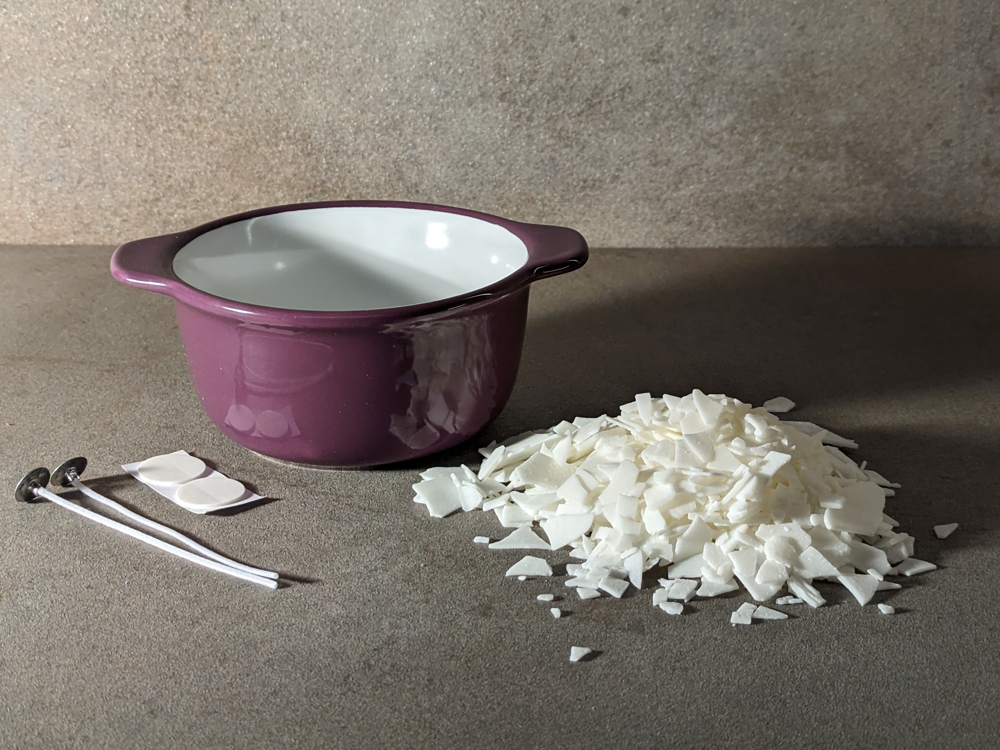
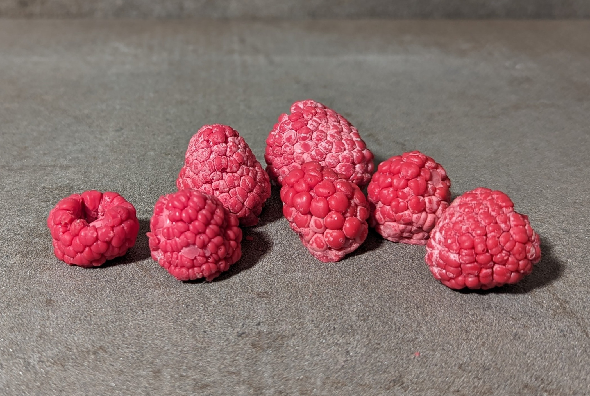
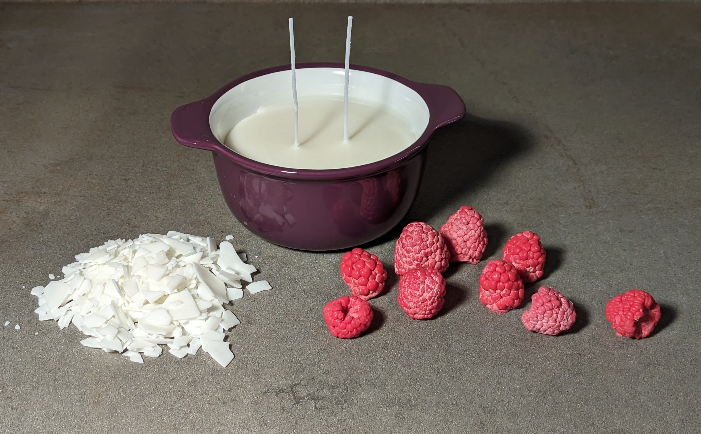
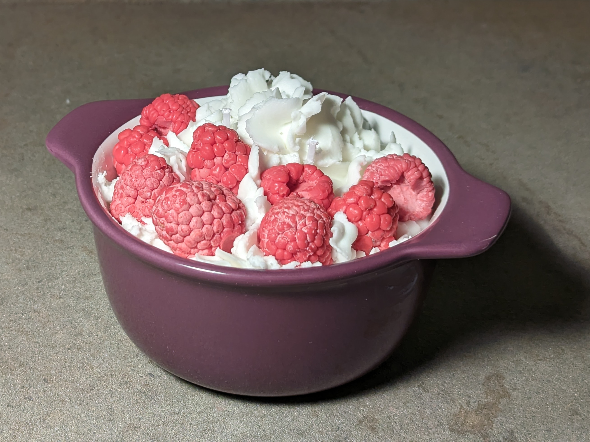

## Eine Kerze zum Geburtstag

Schön dich hier zu sehen!

Heute mache ich eine Geburtstagskerze für Maren und freue mich, dass du mich dabei begleitest. Wie du das eventuell
schon gemerkt hast, hilft es mir sehr, ein kleines Ziel vor den Augen zu haben, um mit einem Projekt anzufangen. Auch in
diesem Fall hatte ich eine Motivation - ein Geburtstagsgeschenk für Maren zu machen.
Da es eine festliche Kerze werden soll und auch ein paar Sachen ausprobieren möchte, habe ich mich dazu entschieden, die
Kerze wie ein kleines Törtchen zu dekorieren.

Dafür verwende ich eine kleine fröhliche Backform, die ich seit Jahren nicht benutze. Das Aufbereiten der Kerze ist in
zwei Phasen aufgeteilt:

- Im ersten Teil bereite ich die schlichte Kerze vor. Hierbei handelt es sich um die eigentlich
  fertige Kerze, die noch nicht dekoriert ist.
- Im zweiten Teil geht es um das Dekorieren der Kerze, wobei ich sowas
  wie das Aufschlagen des Wachses ausprobieren möchte, um den geschlagene Sahne-Look zu erreichen.

## Vorbereitung

### Die "Basiskerze"

#### Wachsmenge

Das Förmchen wird im ersten Schritt nicht ganz voll gemacht.
Um raus zu finden, wie viel Gramm Wachs ich für den ersten Teil der Kerze benötige, benutze ich eine einfache Methode.
Hast du Lust auf ein bisschen Rechnen? Hier ist endlich ein Anwendungsfall für die ganzen Physik- und Chemiestunden!

Es gibt eine schlichte [Formel](https://de.wikipedia.org/wiki/Dichte), um das Gewicht zu berechnen, die wir uns hier
zur Nutze machen können:


\\(Masse = Dichte * Volumen\\)

Die Sojawachs Dichte ist eine Konstante und entspricht [0,9g/cm³](https://de.wikibrief.org/wiki/Soy_candle).

Jetzt müssen wir nur das Volumen rausfinden, welches unsere Kerzenform bis zur gewünschten Linie füllen wird. Zum
Glück kann man dafür das Wasser aus dem Wasserhahn nutzen, da es eine Dichte von
[1,0g/cm³](https://www.chemie.de/lexikon/Eigenschaften_des_Wassers.html#:~:text=Vollkommen%20reines%20Wasser%20besitzt%20eine,(siehe%20Dichte%20und%20Dichteanomalie).)
besitzt. Dafür fülle ich die Form bis zu gewünschten Linie mit Wasser auf. Das Gewicht des Wassers entspricht dem
Wasservolumen. Also wird das Wasser gewogen. In meinem Fall sind das 220gr
Wasser. Also entspricht das einem Volumen von 220ml bzw. 220cm³.

Jetzt kann die benötigte Wachsmenge berechnet werden:


\\(Masse = 0,9 g/cm³ * 220 cm³\\)

Als Ergebnis der Berechnung beträgt 198g Sojawachs.

Möglicherweise kann man mit festem Wachs das Förmchen füllen, um so die notwendige Menge zu schätzen. Diese Methode
ist für mich zu ungenau. Allerdings könnte man auch hier das Verhältnis zwischen dem festen und flüssigen Wachs
rausfinden und es dann umrechnen.

#### Docht

Der Durchmesser vom Backförmchen ist 10cm, ich habe nur relativ dünne Dochte aktuell vorrätig, die einzeln nur für ca
5-6cm breite Kerzen ausreichen, also brauche ich hier zwei Dochte, damit die fertige Kerze gleichmässig brennt.

### Die "Sahne" Schicht

Für die Wachs-Sahne habe ich 50g Sojawachs benötigt. Wie genau ich die "Sahne" hergestellt habe, kannst du
[hier](#das-dekorieren-des-törtchens)
nachlesen

Ein Teil meiner Dekoration, die Wachshimbeeren, habe ich bereits im Voraus vorbereitet. Dafür habe ich Sojawachs mit
roten Farbe gemischt und in Silikonformen gegossen.
Jede Wachsbeere wiegt zwischen 5-10g und wird relativ schnell fest. Ich habe allerdings keine gute Erfahrung damit
gemacht, die Beeren zu schnell aus der Silikonform rauszuholen, weil ich einige Beeren dabei gebrochen habe.
Daher empfiehlt es sich, sowas früh genug vorzubereiten.

## Verwendete Geräte und Inhaltsstoffe

| Bezeichnung                                       | Menge |
|---------------------------------------------------|-------|
| **Inhaltsstoffe**                                 |
| Sojawachs, _Nature C3 Wax_                        | 248g  |                  
| Docht                                             | 2     |                  
| Wachshimbeeren                                    | 9     |     
| **Geräte**                                        |
| Altes Backförmchen (upcycling), Durchmesser 10 cm | 1     |                  
| Topf zum Schmelzen                                | 1     |                  
| größerer Topf für Wasserbad                       | 1     |                  
| Rührspatel                                        | 1     |                  
| Thermometer                                       | 1     |                  
| Esstäbchen                                        | 2     |                  
| Handrührgerät                                     | 1     |
| Spritzbeutel                                      | 1     |
| Föhn                                              | 1     |

## Durchführung

### Die Basis

Das Backförmchen wird von innen und außen mit Wasser und dann mit Spiritus gereining. Die Dochte klebe ich jetzt ein und
klemme sie mit den Essstäbchen ein, damit sie sicher stehen und später nicht verrutschen.

Das Wachs wird im Wasserbad geschmolzen, bis es komplett transparent ist (bei mir sind es 65°C) und dabei gaaaanz
langsam gerührt. Wichtig ist, dass dabei möglichst wenig Luft im Wachs eingeschlossen
wird. Das Wachs lasse ich bis zur Gießtemperatur abkühlen (bei mir sind es um 50°C) und giesse es langsam in das
Förmchen ein.


Vorsicht, Verbrennungsgefahr! Geschmolzenes Wachs ist eine heiße Sache und damit
musst du achtsam umgehen


Achte darauf, dass kein Wasser in das Wachs beim Schmelzen oder beim Eingießen gelangt.

Das Förmchen mit dem heißen Wachs klopfe ich seitlich vorsichtig ab, damit die möglichen Luftbläschen schnell raus
sind. Jetzt wird die Kerze zum Abkühlen in Ruhe gelassen. Es dauert ein wenig, bis das Wachs fest ist, dass die Deko
darin nicht versinkt. In meinem Fall habe ich eine Stunde gewartet, bis ich mich an das zweite Teil ran gemacht habe.

### Das Dekorieren des "Törtchens"

Irgendwie muss die geschlagene “Sahne” auf die Kerze übertragen werden. Das habe ich wie eine echte Konditorin gemacht
und dafür einen Spritzbeutel mit einer Tülle meiner Wahl benutzt. Das hat auch ganz gut funktioniert.

Die 50g Wachs werden auch hier genauso wie im ersten Teil geschmolzen. Nun muss es wieder abkühlen, damit man es
schlagen kann. Es darf weder zu heiß und damit
zu flüssig noch zu kalt und damit schlecht bearbeitbar sein. Bei mir war die richtige Konsistenz bei 39°C erreicht.
Die Wachsoberfläche der Basiskerze habe ich mit einem Föhn leicht angewärmt, so dass die Dekoration anschließend darauf
gut haftet. Hier habe ich auch die Holzstäbchen entfernt, damit sie nicht mehr stören.

Das Wachs habe ich ca. eine Minute geschlagen, ich muss sagen, die Konsistenz erinnert schon sehr an Lebensmittel
Sahne(-alternativen).

Nun schnell in den Spritzbeutel damit und die geschlagene "Sahne" auf die
vorbereiteten Basiskerze anbringen. Dieser Schritt ist zeitkritisch. Das Spannende liegt darin, dass man
nicht so viel Zeit zum Schlagen und
Dekorieren hat, weil das Wachs recht schnell abkühlt und dann zu brüchig wird. Dann lässt es sich nicht mehr gut
ausdrücken und das Dekorieren klappt nicht.

Die Himbeeren werden auf der "Sahne" verteilt und nun kann das Törtchen abkühlen. Nachdem das ganze fest ist, werden
noch
die Dochte gekürzt und voila! Guten Appetit 😆

## Das Nachwort

Tatsächlich fände ich es schön, wenn diese Kerze nach irgendwas Leckerem geduftet hätte.
Die Kerze sieht sehr appetitlich aus, und die Tatsache, dass sie keinen entsprechenden Geruch abgibt,
ist ein wenig irritierend. Es liegt ein Beispiel für die kognitive Dissonanz vor ¯\\\_(ツ)_/¯

Stolz habe ich mein Kerzentörtchen Maren präsentiert. Maren ist eine Person, die sowohl Kerzen als auch schöne Törtchen
mag, daher war ihre Begeisterung eine natürliche und erwartete Reaktion. Und was soll ich sagen, ich mag es sehr, wenn
meine Geschenke Freude bereiten. Darauf folgender Lob schmeichelt meinem Ego und lässt mich auch sehr gut
fühlen. In dem Sinne bin ich recht einfach gestrickt.

Die fröhliche Begeisterung wurde durch kleine Enttäuschung begleitet - auch wenn meine Kerze vegan und hübsch ist,
für Verzehr ist dieses Törtchen nicht geeignet 😉

Yana

