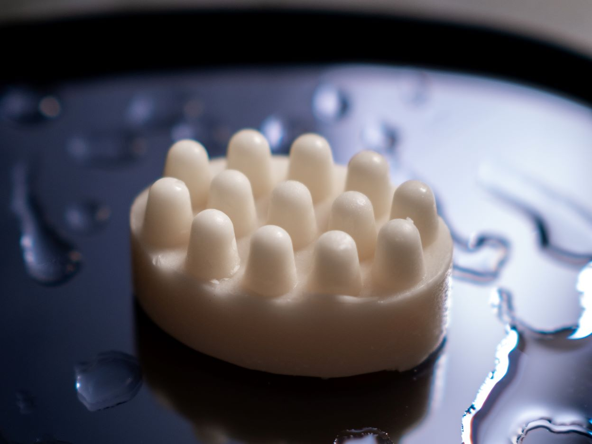
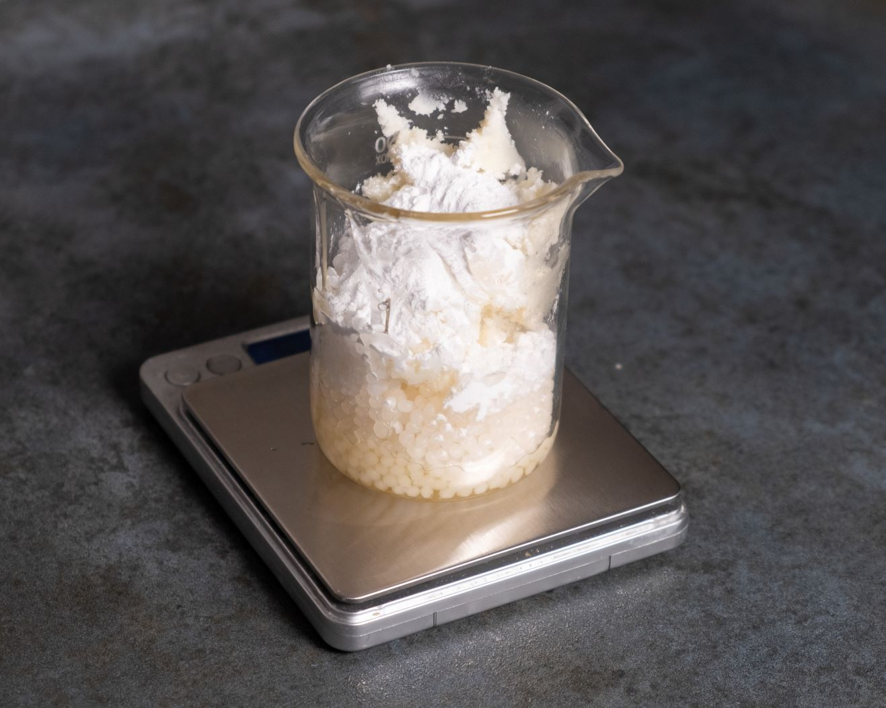
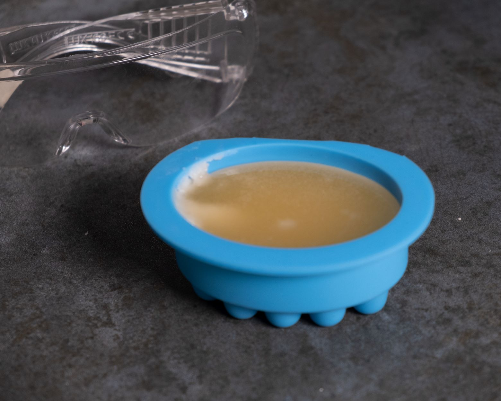

Hey du,
 
wie wäre es mit einem selbstgemachten, natürlichen und veganen Conditioner-Bar? Kürzlich hat mich eine alte Packung "Conditioner Green" im Vorratsregal angelächelt, als ich nach anderen Rohstoffen gesucht habe. Sie schien förmlich zu rufen: "Rette mich! Rette mich!" Ich starrte sie an und überlegte, was ich damit anfangen könnte. Mein verschlafenes Gewissen flüsterte: "Sie wird verfallen, bevor du sie überhaupt berührst!" Doch dann kam mir die Idee, beim Rohstoffanbieter nach einem Rezept zu suchen, das ich schon lange ausprobieren wollte. In der Welt der Formulierung sind wir keineswegs allein, sondern stehen...
   
## …Auf den Schultern von Riesen

Vielen Dank an Alexmo für dieses wunderbare Rezept! Ihr habt bereits herausgefunden, welche Menge an Conditioner und anderen Konsistenzgebern verwendet werden muss, damit das Endprodukt tatsächlich eine feste Form annimmt. Es erfordert einige Versuche, um sich an die richtige Konsistenz heranzutasten. Das Endprodukt soll fest werden, aber nicht so fest, dass es sich nur dazu eignet, die Haare abzuschmirgeln. Unsere Begeisterung für diese cremige, weiche pflegende Textur, die der feste Conditioner erzeugt, nimmt kein Ende.

| Zutat                                              | % Anteil |
|----------------------------------------------------|----------|
| **Hitze-Phase (75-80°C)**                          |          |
| Conditioner Green                                  | 44%      |
| Sheabutter, raffiniert                             | 18%      |
| Montanov™ 82 [Cetearylalkohol (und) Kokosglucosid] | 11%      |
| Arganöl, kaltgepresst                              | 9%       |
| Kakaobutter                                        | 5%       |
| Kokosnussextrakt                                   | 5%       |
| Maisstärke                                         | 4%       |
| **Pufferlösung (warm einrühren)**                      |          |
| Die Pufferlösung                                   | 4%       |

**Die Pufferlösung**

| Zutat                 | % Anteil |
|-----------------------|----------|
| destilliertes Wasser | 50% |
| Natriumlaktat 60%ig | 31.5% |
| Milchsäure 80%ig | 18.5% |

Das Originalrezept ist ein reichhaltiger [fester Conditioner](https://www.alexmo-cosmetics.de/Rezeptwelt/Conditioner-Bar), der einen sanften und cremigen Film auf den Haaren hinterlässt. Er sorgt für eine verbesserte Kämmbarkeit,  die Haare wirken nach der Anwendung weich und geschmeidig. Die Mischung des Conditioners Green und Montanov™ 82 MB in Kombination mit einem hohen Öl- und Butteranteil sorgt für diese angenehme Konsistenz und pflegende Wirkung. Conditioner Green wirkt dabei konditionierend, und durch die Zugabe einer Pufferlösung wird der pH-Wert reguliert, um seine Wirkung optimal zu entfalten.

## Fester Conditioner, der II. von MixWithUs

Wir hatten kein Montanov™ 82  zur Hand. Anstelle dessen konnten wir auf einzelne Rohstoffe zurückgreifen - Cetearyl Alkohol und Kokosglucosid. Wir kennen das ursprüngliche Verhältnis nicht, deswegen haben wir eine Schätzung vorgenommen, und das Verhältnis von ungefähr 70% Cetearyl Alkohol zu 30% von Kokosglucosid ausgewählt. Außerdem haben wir Maisstärke durch Reisstärke ersetzt, was die Endkonsistenz des Conditioner-Bars nicht maßgeblich beeinflusst, sondern sich daran richtet, mit welcher Stärke wir persönlich gern arbeiten und vorrätig haben. Es wäre denkbar, eine andere Art von Stärke, wie zum Beispiel Tapiokastärke, zu benutzen. In unserer Rezeptur haben wir auf die Verwendung von Kakaobutter verzichtet und stattdessen den Anteil an Sheabutter erhöht. Dabei haben wir bewusst die unraffinierte Version von Sheabutter gewählt, um unserem Conditioner-Bar einen warmen, nussig-schokoladigen, rauchigen Duft von Shea zu verleihen. Wenn du ein Fan von Kakaobutter bist, beachte bitte, dass du die Sheabutter durch Kakaobutter nicht vollständig ersetzen kannst. Diese Änderung würde zum Problem beim Nachhärten des Endprodukts führen. Kakaobutter verändert bei hohen Temperaturen seine Struktur und kann nicht wieder erhärten. Ein wichtiger Pflegewirkstoff in unserer Formulierung ist Phytosteryl Macadamiate, der zur Verbesserung der Haarkonditionierung beiträgt. Dieser Inhaltsstoff kann das Haar geschmeidig machen und ihm einen gesunden Glanz verleihen. 

| Zutat | % Anteil | Funktion |
|----------|------------|-----------|
| **Hitze-Phase (75-80°C)** |      |       |
| Conditioner Green | 44% | kationisches Tensid, wirkt konditionierend bei saurem PH-Wert zwischen 3-5, verbessert Kämmbarkeit |
| Sheabutter, unraffiniert | 27% | Basisbutter, pflegend |
| Arganöl, kaltgepresst | 9% | Basisöl, pflegend |
| Cetearyl Alkohol | 8% | Konsistenzgeber |
| Reisstärke | 4% | Gelbildner |
| Kokosglucosid | 3% | Tensid |
| Phytosteryl Macadamiate | 1% | Emollient, Rückfetter |
| **Pufferlösung (warm einrühren)** |     |      |
| Die Pufferlösung | 4% | PH-Wert Regler |

## Zubereitung

Du brauchst

* mehrere Gefäße zum Abwiegen und einen hitzefesten Behälter 
* Einige Spatel/Löffelchen zum Abwiegen und Rühren. Je mehr du hast, desto weniger bist du mit dem Reinigen bei der Zubereitung beschäftigt
* Eine Waage mit einer Genauigkeit von 0,01 Gramm
* Ein Allgebrauchsthermometer (in Stabform)
* Eine Silikonform für den festen Conditioner
* Desinfektionsmittel zum Reinigen der Oberflächen und Gefäßen
* Einweg Latexhandschuhe oder Nitrilhandschuhe, solltest du eine Latexallegie haben
* Schutzbrille

---
1. Bevor du startest, nimm deinen Schmuck ab, zieh die Handschuhe an und desinfiziere gründlich die Arbeitsfläche sowie alle Geräte und Gefäße, einschließlich der Silikonform.
2. Beginne mit der Pufferlösung: Wiege sie in einem separaten Behälter ab und vermische sie gut. Denk daran, die Schutzbrille zu tragen, um deine Augen vor unerwünschten Unfällen zu schützen.
3. Nimm nun die Bestandteile der Hitzephase einzeln und wiege sie ab. Gib sie in einen hitzebeständigen Behälter und erhitze sie auf 80 °C. Vermische alles gründlich, bis keine Klümpchen mehr sichtbar sind.

4. Schalte die Hitze ab und füge vorsichtig die Pufferlösung in die Mischung ein. Gut umrühren.
5. Lass die Mischung abkühlen, bis sie optisch trüb wird, etwa bei einer Temperatur von 35°C. Gieße sie dann in die gewünschte Form.

6. Kratze die übrige Mischung von den Rändern der Form ab und füge sie ebenfalls vorsichtig hinzu.
7. Lass den Conditioner-Bar einen Tag ruhen, bevor du ihn aus der Form entnimmst und verwendest.

## Anwendung

Um den Conditioner-Bar optimal anzuwenden, kannst du ihn leicht unter warmem Wasser erwärmen, während du duscht. Dies macht die Handhabung beim Auftragen einfacher. Massiere den Conditioner-Bar in die Haarlängen bis in die Spitzen ein. Bei Haaren, die nicht schnell fettig werden, kannst du das Conditioner-Bar auch behutsam in den Haaransatz einarbeiten. Anschließend lasse ihn trocknen, am besten auf einer Ablage fern von Wasser und Feuchtigkeit.

### Nachwort 
Unser Ansatz war es, die Formel zu vereinfachen und ihr einen einzigartigen Duft zu verleihen, indem wir uns für eine natürliche Beduftungsstrategie entschieden haben. Dabei möchten wir dich nicht nur zum Ausprobieren bewegen, sondern auch zeigen, wie du die Formel an deine eigenen Vorräte und individuellen Bedürfnisse anpassen kannst. Es war uns wichtig, dass du neben dem Ergebnis auch etwas Neues dazulernst und so deinen ganz persönlichen Conditioner-Bar erschaffen kannst.

Viel Spaß beim Nachmachen!


