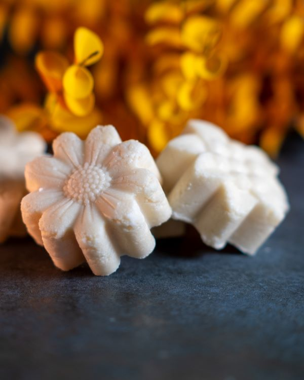

Hey du,

heute stellen wir gemeinsam einen festen Shampoo-Bar her, und es wird fleißig geknetet. Es hat ganze fünf Anläufe gebraucht, bis ich die richtige Formel und Vorgehensweise ausgearbeitet habe. In diesem Prozess habe ich eine Fülle an wertvollen Erfahrungen gesammelt, die ich gerne mit dir teilen möchte. Das intensive Kneten während der Entwicklungsphasen hat sogar für einen leichten Muskelkater gesorgt. Manchmal wünschte ich, meine Katze hätte mir bei diesem Projekt geholfen – sie knetet so gerne ihre warme Kuscheldecke, die wir wegen der anhaltenden Regenfälle wieder rausholen mussten. Trotzdem konnte ich mich in den sanften Rosenduft hüllen und in Erinnerungen an laue Sommernächte schwelgen. Heute muss ich jedoch nicht so viel kneten, denn ich habe dich dabei ;-) Also, lass uns an die Arbeit machen!

| Phase | Zutat                                 | Anteil % | Funktion                                          |
|-------|---------------------------------------|----------|--------------------------------------------------|
| A     | Sodium Coco Sulfat                   | 60%      | Reinigungsmittel                                  |
| A     | Reisstärke                            | 10.5%    | Verdickungsmittel                                 |
| B     | Sodium Babassuamphoacetat            | 20%      | Sanftes amphotheres Tensid                                    |
| B     | Cetyl Alkohol                        | 5%       | Konsistenzgeber                                   |
| B     | Rosenwachs                                | 3%       | Konsistenzgeber, Duftträger                                   |
| C     | Milchsäure 80%ig                     | 1%       | pH-Wert Regulierung                               |
| D     | Duftmischung (Vanilleextrakt & Orangenöl) | 0.5%     | Duftträger                                   |

## Der Shampoo-Bar von Mix With Us
Unser Shampoo-Bar zeichnet sich durch sein ausgezeichnetes Schaumverhalten aus - er erzeugt einen dichten, kompakten Schaum und behält gleichzeitig seine sanfte Reinigungskraft bei. Wir setzen auf eine natürliche Beduftungsstrategie, indem wir Rosenwachs, ätherisches Orangenöl und Vanilleextrakt miteinander kombinieren. Diese harmonische Mischung verleiht unserem Shampoo-Bar eine angenehme Duftkomposition, die Erinnerungen an warme Sommernächte wachrüttelt.
Der Shampoo-Bar besteht hauptsächlich aus einer Kombination von zwei milden Tensiden - Sodium Coco Sulfat und Sodium Babassuamphoacetat. Der größte Vorteil dieses Tensid-Duos liegt in seiner Eignung für Naturkosmetik-Formeln. Wir verstehen jedoch, dass es nicht immer von jedem Rohstoffhändler angeboten wird. Falls du Sodium Babassuamphoacetat nicht beim Rohstoffanbieter deiner Wahl finden kannst, ist es leicht durch andere amphotere Tenside ersetzbar - z. B. durch Cocamidopropyl Betain. Dennoch solltest du dabei den pH-Wert selbst kontrollieren und entsprechend einstellen, da ein anderes Tensid im anderen pH-Bereich liegen könnte.
Die übrigen Zutaten sind bewusst simpel gehalten, um die Formel so einfach wie möglich für deine eigenen Versuche zu gestalten. Damit erhältst du die Freiheit, individuelle Variationen auszuprobieren und deine perfekte Mischung zu erschaffen.

## Herstellung

Du brauchst

* Mehrere Gefäße zum Abwiegen
* Einen hitzefesten Behälter und eine hitzefeste Schüssel
* Zwei Töpfe für ein heißes Wasserbad
* Ein Thermometer (z.B. Infrarot-Thermometer)
* Einige Spatel/Löffelchen zum Abwiegen und Rühren (je mehr du hast, desto weniger wirst du mit Reinigen während der Zubereitung beschäftigt sein)
* Eine Waage mit einer Genauigkeit von 0,01 Gramm
* Eine Silikonform für das feste Shampoo
* Desinfektionsmittel für Oberflächen und Gefäße
* Einweg-Latexhandschuhe oder -Nitrilhandschuhe (falls du eine Latexallergie hast)
* Schutzbrille
* Feinstaubmaske
* Elektrische Mühle
---	
1. Beginne mit der Planung und gehe von etwa 50 Gramm pro Stück für den festen Shampoo-Bar aus. Die genaue Menge für deine Form musst du entweder durch eine detaillierte Berechnung oder Beobachtung ermitteln.
2. Bevor du beginnst, entferne deinen Schmuck, ziehe Handschuhe an und reinige gründlich die Arbeitsfläche sowie alle Geräte und Gefäße, einschließlich der Silikonform.
3. Setze die Feinstaubmaske auf, wiege das Sodium Coco Sulfat ab und mahle es zu feinem Staub. Die Maske ist unerlässlich, da sie dich vor dem Einatmen der feinen Partikel schützt. Das Mahlen dient dazu, eine homogene Masse zu erhalten, um das Kneten und die Handhabung zu erleichtern.

4. Wiege die restlichen Zutaten der Phase A ab. Gib sie in eine Schüssel und platziere die Schüssel auf einem heißen Wasserbad. Rühre gelegentlich um, bis sie sich erwärmt haben.

5. Wiege die Zutaten der Phase B ab. Sie kommen ebenfalls in ein warmes Wasserbad. Füge sie jedoch erst hinzu, wenn Phase A etwa 35-40°C erreicht hat, da Phase B schneller heiß wird.

6. Wiege die Zutaten der Phasen C und D ab. Trage hierbei unbedingt deine Schutzbrille (Handschuhe sollten während des gesamten Herstellungsprozesses getragen werden), da du keine Säure oder ätherischen Öle auf deine ungeschützte Haut oder in die Augen abbekommen möchtest.
7. Sobald die Phasen A und B die gewünschten Temperaturen erreicht haben, mische sie gründlich. Füge Phase B zur Schüssel mit Phase A hinzu und vermische die Phasen sorgfältig. Entferne die Schüssel nun vom Wasserbad.

8. Füge Phase D zur Masse in der Schüssel hinzu und rühre weiterhin gründlich um.
9. Sobald die Masse eine angenehme Temperatur erreicht hat, etwa 45-40°C, ist es Zeit zum Kneten. Strebe eine homogene, teigige Konsistenz an.

10. Füge zuletzt deine Duftmischung zur Phase hinzu. Beachte, dass Duftöle und ätherische Öle hitzeempfindlich sind. Halte dich an die Empfehlungen deines Rohstoffanbieters und achte auf die maximal zulässige Temperatur.
11. Zum Abschluss portioniere deine Masse und presse sie gleichmäßig in die Silikonform. Achte darauf, dass die Masse gut verteilt ist und du keine Hohlräume eingeschlossen hast.

12. Am nächsten Tag kannst du die Shampoo-Bars aus der Silikonform entnehmen. Sie benötigen 4 bis 5 weitere Tage, um ihre Endkonsistenz zu erreichen.

### Nachwort

Die Umsetzung dieses Projekts hat sich als anspruchsvoller herausgestellt als gedacht, aber die Erfahrung war äußerst lohnend. Falls du unserem Instagram-Account folgst, hast du sicherlich schon Einblicke in unsere wichtigsten Lektionen erhalten. Dort halten wir dich auch über kommende spannende Projekte auf dem Laufenden. Deine Unterstützung und Interaktion sind für uns von unschätzbarem Wert, wir freuen uns über dein konstruktives Feedback. Und, wie gewöhnlich … Viel Spaß beim Nachmachen!


